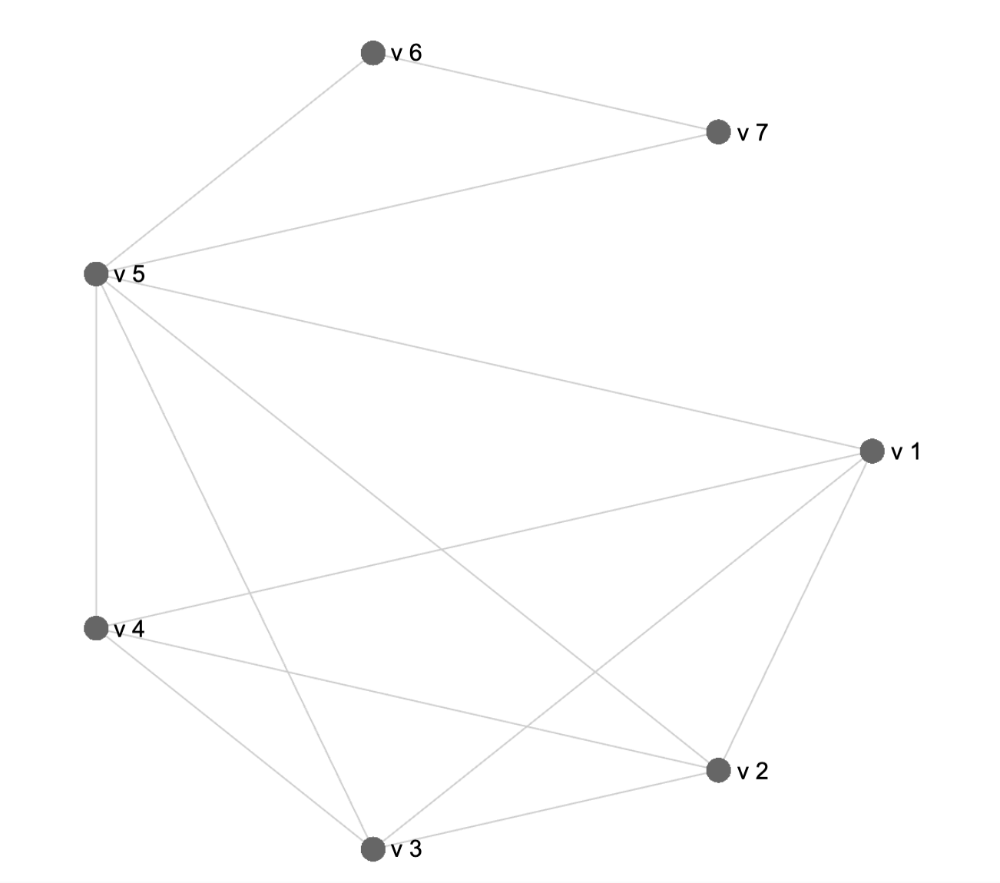
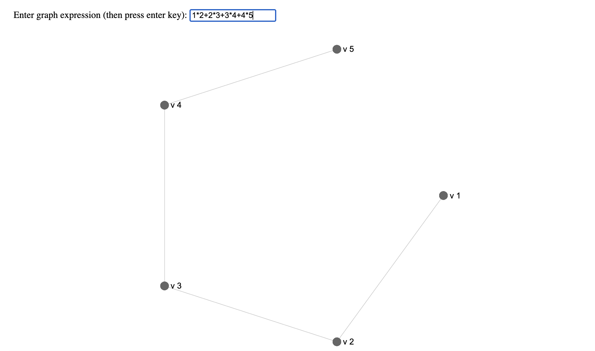
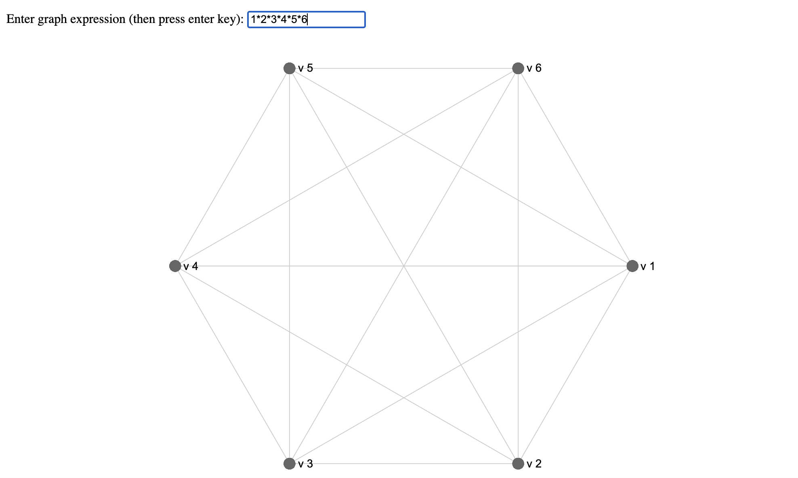
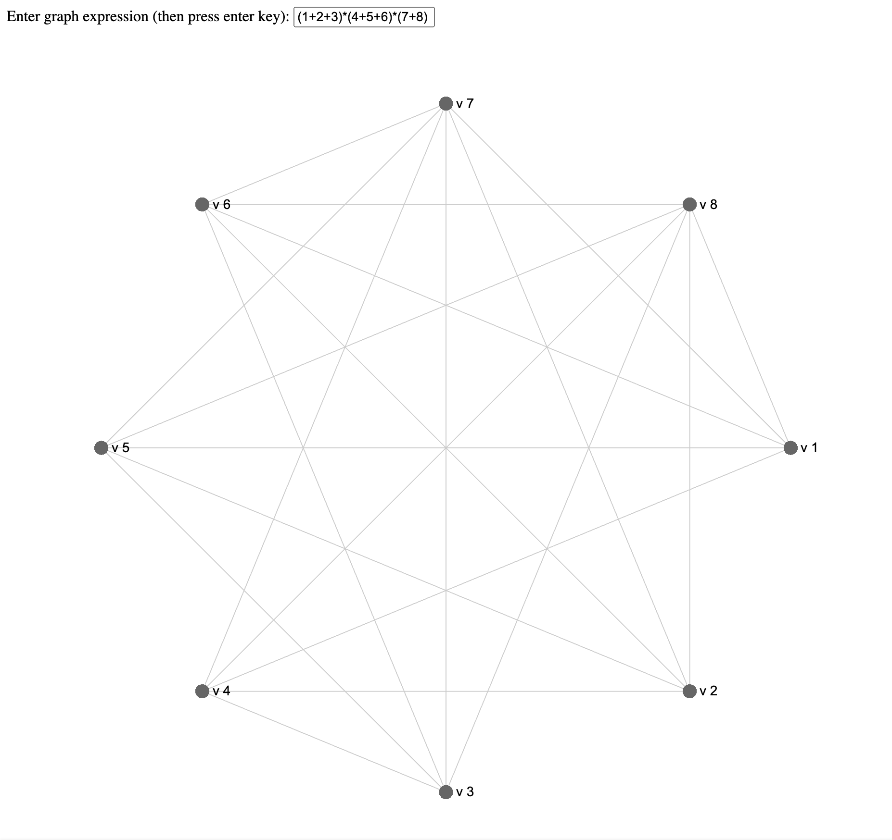

# Welcome to ZykovAlgebraLibrary 🌐

Greetings, curious coder! Dive into the realm of graph theory with the `zykovEngine` - a sophisticated JavaScript library designed to craft, manipulate, and visualize graph structures using algebraic operations. 

## About zykovEngine

The `zykovEngine` is inspired by A. A. Zykov's pioneering 1949 algebraic approach to graph theory in `General Properties of Linear Complexes`, and featured in the recent 2025 work by A.Bustamante et al. titled `A Zykov algebra approach to clique propagation:
Classifying clique complexes in graphs`, [to be published soon in Discrete Mathematics, Algorithms and Applications](https://www.worldscientific.com/doi/abs/10.1142/S1793830925500806).  With the modern elegance of JavaScript, this library breathes life into graph expressions, offering an intuitive way to interact with and visualize them.

### Features:
- 🚀 **Simple Operations**: Effortlessly perform graph algebraic operations like addition and multiplication.
- 📊 **Visualization**: Witness the beauty of your algebraic graph expressions brought to life.
- 💡 **Intuitive Parsing**: Translate human-friendly graph expressions into machine-understandable structures.
  
### Use Cases:
Whether you're a mathematician trying to visualize complex graph structures or a developer wanting to integrate algebraic graph operations into your app, `zykovEngine` is your key to unlock the rich world of graph algebra.

## Getting Started

1. Dive into our [documentation](#Graph-Visualization-Tool) to explore the capabilities of the `zykovEngine`.
2. Run the [live demo](https://stackblitz.com/edit/web-platform-cxi1fv?embed=1&file=index.html&hideExplorer=1&hideNavigation=1&view=preview) to witness the magic in action.
3. Clone, star, or fork the repository from [here](https://github.com/Anekemuthep/ZykovAlgebraLibrary/tree/main) to embark on your graph algebra journey.

---

Feel the algebraic pulse of graphs with `zykovEngine`. **Happy graphing!**

---

# Graph Visualization Tool 

This tool allows users to visualize graphs in a unique and concise manner. Using numbers as vertex representations, we define two primary operations: addition and multiplication.

## Vertex Representation

Each number `n` represents a unique vertex. For instance:
- `1` is a vertex
- `2` is another vertex
... and so on.

## Operations

### Addition (`+`)

The addition of two numbers (or vertex representations) `a + b` indicates that vertices `a` and `b` are independent and have no edges connecting them.

### Multiplication (`*`)

The multiplication of two numbers `a * b` signifies that there's an edge between vertices `a` and `b`.

## Algebraic Representation of a Graph

Consider the algebraic representation: 

`G = 1*2 + 1*3 + 1*4 + 1*5 + 2*3 + 2*4 + 2*5 + 3*4 + 3*5 + 4*5 + 5*6 + 5*7 + 6*7`

For the graph:



Here, 
- There's an edge between vertices 1 and 2 (`1*2`), vertices 1 and 3 (`1*3`), and so on.
- Edges `5*6` and `5*7` as have a common vertex 5, the sub-expression `5*6 + 5*7` can also be written equivalently as `5*(6+7)`.
- In the article by A.Bustamante et al. can be seen that the sub-expressions `1*2 + 1*3 + 1*4 + 1*5 + 2*3 + 2*4 + 2*5 + 3*4 + 3*5 + 4*5` and `5*6 + 5*7 + 6*7` because of `Zykov Concentration` (see pages 14-16 of the refered work) can be written as `1*2*3*4*5` and `5*6*7`respectivley, being `G = 1*2*3*4*5 + 5*6*7` a valid algebraic equivalence.

## Visualization

Once you input this graph representation into `Enter graph expression (then press enter key)` as
```
   1*2 + 1*3 + 1*4 + 1*5 + 2*3 + 2*4 + 2*5 + 3*4 + 3*5 + 4*5 + 5*6 + 5*7 + 6*7
```
or
```
   1*2*3*4*5 + 5*6*7
```
it will visualize the graph showing all the vertices and the connections (edges) between them.

## Examples:

1. **Path Graph**: Let us write a [Path Graph](https://mathworld.wolfram.com/PathGraph.html#:~:text=The%20path%20graph%20is%20a,Gross%20and%20Yellen%202006%2C%20p.) of five nodes. In `Enter graph expression (then press enter key)` write the following:
   ```
   1*2 + 2*3 + 3*4 + 4*5
   ```


2. **Complete Graph**: Let us write a [Complete Graph](https://mathworld.wolfram.com/CompleteGraph.html) of six nodes. In `Enter graph expression (then press enter key)` write simply the following:
   ```
   1*2*3*4*5*6
   ```


2. **Complete Tripartite Graph**: Let us write a [Complete Tripartite Graph](https://mathworld.wolfram.com/CompleteTripartiteGraph.html) of 3,3,2 nodes. In `Enter graph expression (then press enter key)` write the following expression:
   ```
   (1+2+3)*(4+5+6)*(7+8)
   ```

